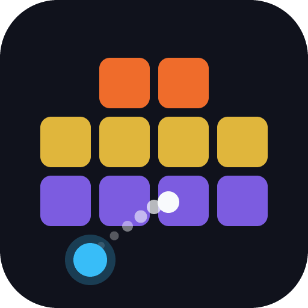

<div align="center">



# Game Collection

**A collection of casual games for Android, Windows and Linux.**

Built with Flutter. Fully offline — no accounts, no ads, no network, no tracking.

[](LICENSE)
[](https://flutter.dev)
[](#building)

</div>

---

## What's in it

The app opens on a searchable overview of every game, grouped into sections,
with favourites pinned on top. Settings cover theme, language (English and
German), sound and volume, the screen wake lock, and a full data reset.

| Game | | |
| --- | --- | --- |
| **Ricochet** | Arcade | Aim a volley of bouncing balls, crush numbered bricks, and ride endlessly through self-generating levels. |

More to come — the architecture is built so a new game is a folder plus one line
in the registry.

---

## Ricochet

Drag anywhere to aim; a dashed preview shows the trajectory and the first
impact. Release and up to **100 balls** launch per turn, staggered, ricocheting
off walls and bricks. Every brick shows its HP; each hit removes 1, and at 0 it
shatters for points.

After every volley the board **drops one row**. If any brick crosses the red
danger line, the run ends. Clear the whole board and you get a score bonus, +2
balls, and a freshly generated next level. There is no final level — only your
best score.

### Tiles

Except the (+) pickup, every tile carries HP and breaks like a normal brick. The
effect is what happens *in addition*.

| Tile | Effect |
| --- | --- |
| **Brick** | Plain target. Points = `max HP × 10 + level × 2`. Its colour tracks how tough it is — orange at 1 HP, sweeping to violet at 50+. |
| **Bomb** | Dies to a single hit regardless of HP and explodes: everything within ~2 cells takes lethal damage. Chains through other bombs. |
| **Gift (?)** | Fires one random power-up on destruction: +10 balls, pierce, bomb, or clear row. |
| **×2** | Pays double points, with its own popup. |
| **Pierce (»)** | Banks a pierce charge — one ball of your next volley drills straight through bricks instead of bouncing. |
| **Blast** | Banks a bomb charge — one ball explodes on every impact for up to 50 damage in a radius. |
| **Ramp** | A solid triangle filling half its cell. The 45° slope deflects the ball a quarter turn; the flat legs bounce normally, and the empty half is air the ball passes straight through. |
| **Orb** | A round bumper: reflects off its curved surface, so outgoing angles fan out from the point of impact. Being round, the corners of its cell are empty air. |
| **(+) pickup** | Not a brick — no HP, cannot be shot away. Collected on touch for a permanent +1 ball. |

Charges **stack**: bank several and several balls of your next volley inherit
the effect. A ball can be both pierce and bomb. Whatever is banked shows as a
chip in a fixed spot just above the launcher — it stays put wherever the
launcher slides to.

The in-game **How to play** page draws every one of these tiles with the game's
own painter, and loops an animation of each tile that bends a ball's path. It
cannot drift from what you actually see on the board.

### Level design

Every board is cut from one of **nineteen hand-drawn stencils**, auto-centred on
a seamless 13-column grid and randomly mirrored. A clear zone above the danger
line is guaranteed, so every tile is reachable. Tall compositions may start up to
four rows above the top edge and slide into view one row per turn. From level 8,
two stencils usually stack into one bigger composition.

Special tiles arrive from three independent sources, so no kind is hostage to
which stencil got drawn: hand-placed **stencil art** (the invader's orb eyes, the
castle's pierce towers), a **per-tile roll** on every plain brick, and a **rare
seeding pass** that converts a handful of plain tiles. Without that last pass,
ramps and orbs would each live in exactly one layout.

Kinds unlock as you climb — blast at level 3, pierce at 5, orbs at 7, ramps at
10 — so early levels stay simple and the exotic mechanics ease in.

### Controls

| Input | Action |
| --- | --- |
| Drag / release | Aim and fire |
| **Recall** | Instantly pulls all balls back, so a stuck shot can never trap you |
| **Speed** | Each press stacks another boost — ×3, ×6, ×9, ×10 max — until the turn ends. Kicks in on its own at ×3 if a volley drags past six seconds |
| **Power-ups** | Unlimited-use menu: +10 balls, pierce volley, bomb volley, clear row |
| **Replay** | Restarts the current level from its start |

### Progress

Level, score, ball count and the current board are saved automatically — leave
mid-level and resume where you left off. Best score persists across runs. On
game over you can **retry the level**, restored exactly as it looked when the
level began, or **start over** from level 1. A volley keeps resolving in real
time even if you switch away mid-turn, and the screen is held awake only while a
turn is actually playing out.

---

## Building

Requires the Flutter SDK (stable channel) and the toolchain for your target
platform. Then:

```sh
flutter pub get
flutter run -d windows      # or -d linux, or an attached Android device
```

Release builds and packaging go through `build.sh`:

```sh
./build.sh help             # list every target
./build.sh apk              # universal Android APK
./build.sh apks             # split per ABI
./build.sh bundle           # Android App Bundle
./build.sh windows package  # Windows release + zip with installer
./build.sh linux package    # Linux release + zip with installer
./build.sh clean windows    # clean first
```

Artifacts land in `dist/`. A packaged zip contains the build plus an installer:
`install.sh` on Linux, `install.bat` / `install.ps1` on Windows. Both install
per-user with no root or admin rights, register a launcher entry, and support
`--uninstall` / `-Uninstall`. Neither touches your saved games.

### Verifying a change

```sh
dart format ./lib ./test
flutter analyze
flutter test
```

### Regenerating the icon

The logo is drawn in code so it can be tweaked in a diff rather than swapped as
an opaque binary:

```sh
dart run tool/generate_logo.dart
dart run flutter_launcher_icons
```

---

## Architecture

```
lib/
  app.dart                 Router — game routes generated from the registry
  main.dart                Bootstrap: splash first, startup I/O behind it
  core/
    game_model.dart        GameModel / GameSection metadata
    game_registry.dart     The one list everything else is generated from
    game_page_state.dart   DisposeCleanup mixin
  games/<name>/
    config.dart            Metadata. The only place the game's id appears
    <name>_page.dart       Thin coordinator: frame clock + composition
    engine/                The simulation — no widgets, no BuildContext
    widgets/               One file per visual component
  helpers/wav_builder.dart In-memory PCM WAV synthesis
  l10n/                    ARB sources (en, de) + generated localisations
  pages/                   Overview and settings screens
  providers/app_state.dart Global state
  services/                Database, settings, audio
  theme/, widgets/         Theme and shared widgets
```

The load-bearing rule is the **engine/view split**: a game's simulation lives
under `engine/` and never imports a widget or holds a `BuildContext`. That makes
it testable headlessly — the Ricochet suite exercises volleys, explosion radii
and save round-trips with no widget tree and no database — and keeps a frame's
work out of the widget tree.

Nothing rebuilds per frame. The engine exposes two separate listenables: one
that fires every frame and drives the `CustomPainter` directly, and one that
fires only when a number the HUD shows actually changed.

Boards are **resolution-independent**. Ricochet's is 480×760 logical units,
scaled to fit whatever room it gets, with pointer input mapped back through the
same transform. A phone and a maximised desktop window play the identical game,
and a save moves between them unchanged.

Sound effects are **synthesized, not shipped**. `WavBuilder` renders small PCM
clips in memory that SoLoud plays from memory — a few kilobytes each, always in
sync with the code, and free to add a variant of. If a machine has no working
audio backend, the game stays fully playable and silent.

Adding a game is a folder under `lib/games/` plus one line in
`GameRegistry.all`; routes, providers and the overview grid follow automatically.
See [`docs/creating-a-game.md`](docs/creating-a-game.md) for the walkthrough and
[`AGENTS.md`](AGENTS.md) for the full conventions.

---

## Credits

Ricochet is a Flutter port of [Ricochet](https://renierr.github.io/brick-game/),
originally a vanilla HTML5 Canvas browser game. The Flutter version keeps the
physics, the level generator and all nineteen stencils intact, and adds
localisation, persistent settings, a responsive HUD and a native audio engine.

## License

[GNU AGPL-3.0-or-later](LICENSE)
